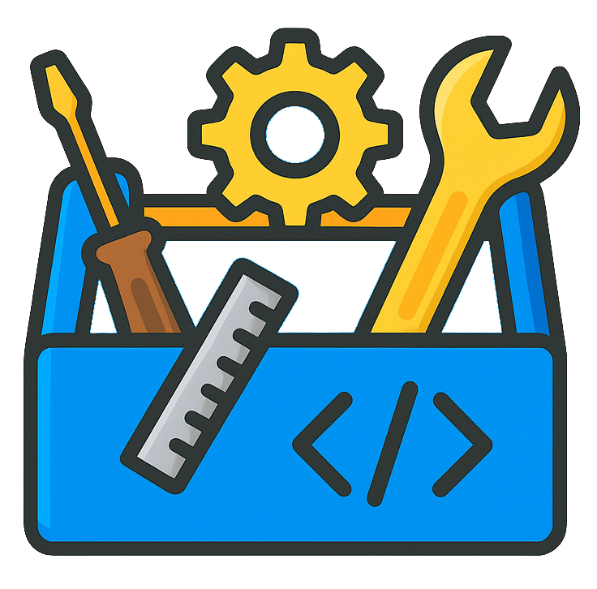
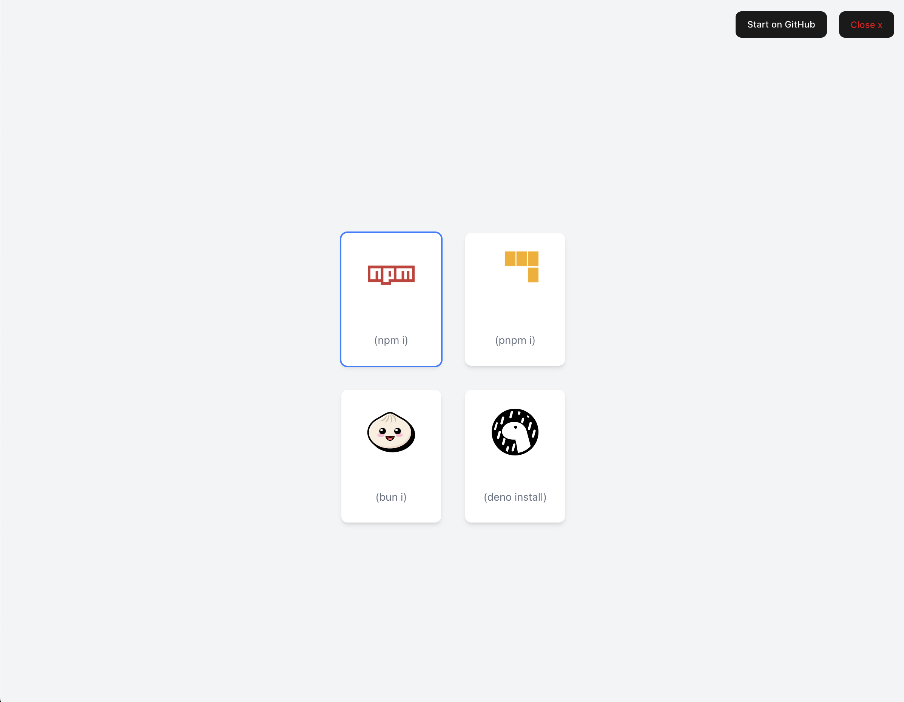
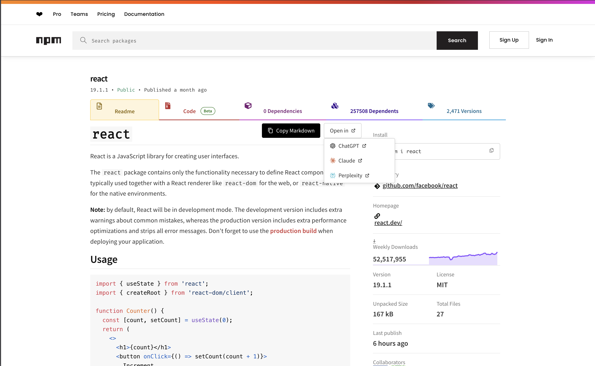

# DevToolbox 🔧

<div align="center">

</div>
DevToolbox is a lightweight Chrome extension that makes working with NPM packages easier.
With just a click, you can:

* Copy ready-to-use **Markdown snippets** directly from the NPM website.
* Instantly switch installation commands depending on your preferred **package manager** (npm, yarn, pnpm, bun).

---

## ✨ Features

* 📦 Copy Markdown package info (great for READMEs & docs)
* 🔄 Auto-switch install command for npm, deno, pnpm, or bun
* ⚡ Minimal, fast, and easy to use

---

## 📸 Screenshots




---

## 🚀 Installation

1. Clone the repo:

   ```bash
   git clone https://github.com/zf0x00/devtoolbox.git
   cd devtoolbox
   pnpm i
   pnpm run zip //for zip format
   ```
2. Open Chrome and go to:
   `chrome://extensions/`
3. Enable **Developer mode** (toggle in the top right).
4. Click **Load unpacked** and select the `devtoolbox` folder.

---

## 🛠 Usage

1. Visit any package page on **npmjs.com**.
2. Copy the Markdown snippet or grab the install command in your preferred package manager.

---

## 🧩 Roadmap

* [ ] Customizable snippet formats
* [ ] more LLM Provider

---

## 🤝 Contributing

Pull requests are welcome! For major changes, please open an issue first to discuss what you’d like to improve.

---

## 📜 License

[MIT](LICENSE)

---

👉 Do you want me to also create a **short tagline + badges (npm, Chrome Web Store, license, stars)** at the top, so your README looks more professional like popular open-source projects?
